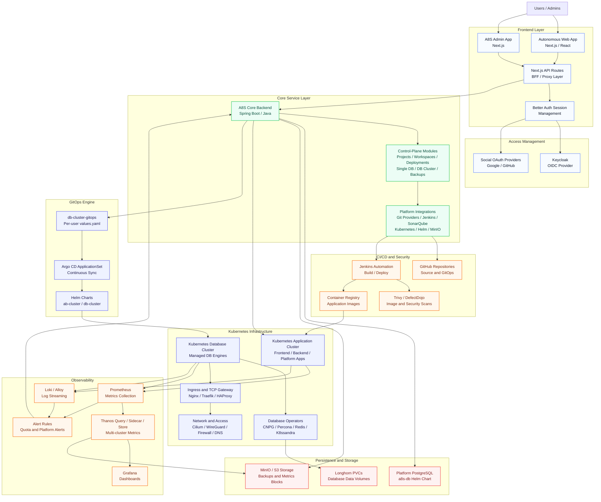
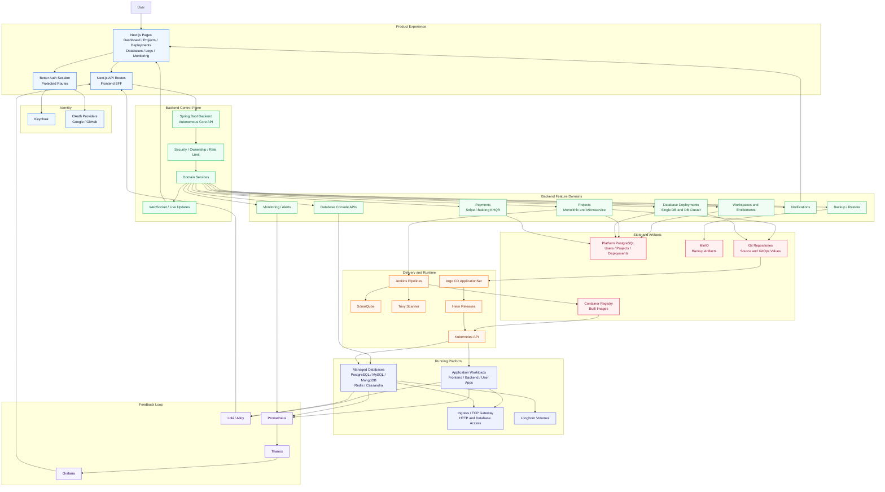

# Autonomous Infrastructure and Architecture

Project scanned from: `D:\CSTADPreUniversityTraining\ITP\a8sfinallProject`

This document describes the infrastructure and architecture of the Autonomous project based on the project folders and configuration files in the workspace.

## 1. Infrastructure Description

Autonomous is built as a self-service platform that runs on Kubernetes and is managed with a GitOps operating model. The project is split into multiple folders that represent the product application, platform services, database platform, infrastructure automation, monitoring, security, and network access.

At the application layer, the platform has a Next.js frontend and admin interface. The main frontend is in `a8s-frontend`, and the admin/documentation-facing apps are in `a8s-admin` and `a8s-documentation`. These apps are containerized with Docker and expose the user interface, API routes, authentication callbacks, dashboard pages, project pages, database deployment pages, monitoring pages, logs, image scanning, and GitHub integration screens.

The control-plane backend lives in `a8s-backend`. It is a Spring Boot application written in Java. It provides secured REST and WebSocket APIs, handles authentication-aware actions, manages projects, provisions databases, runs backup and restore operations, integrates with Kubernetes, talks to MinIO object storage, connects to Git providers, triggers Jenkins/SonarQube workflows, and exposes monitoring and notification services.

The persistence layer has two important parts. First, the platform itself uses PostgreSQL from the `a8s-db` Helm chart for application data. Second, user-facing managed database deployments are handled by the database cluster platform in `ab-cluster`, `db-cluster`, `database-cluster`, and `db-cluster-gitops`. The database platform supports PostgreSQL, MySQL, MongoDB, Redis, and Cassandra through Kubernetes operators and Helm charts. Persistent storage is configured with Longhorn-backed PVCs, and database backups are designed to use MinIO/S3-compatible object storage.

The infrastructure layer is Kubernetes-first. The `a8s-infra` folder contains automation for Kubernetes setup, ingress creation, CSI drivers, metrics server, Cilium networking, and Ansible/Kubespray-style infrastructure tasks. The `ingressSetting` folder documents a Traefik TCP gateway that runs as a host-networked DaemonSet on Kubernetes nodes and exposes database protocols through ports such as `15432`, `13306`, `16379`, `17017`, and `19042`.

GitOps is handled by Argo CD. The `db-cluster-gitops` repo contains an `ApplicationSet` that watches user database values and syncs the `ab-cluster/db-cluster` Helm chart into user namespaces. The backend creates or updates per-user values files, Git commits and pushes them, and Argo CD creates, updates, or prunes the Kubernetes resources automatically.

Observability is handled through Prometheus, Grafana, Thanos, Loki, Alloy, and alerting rules. The `multi-cluster-monitoring` folder describes Prometheus plus Thanos sidecars in source clusters, with centralized Thanos Query, Store Gateway, Grafana, and MinIO in the main monitoring cluster. The `namespace-per-user-log` folder adds namespace-level quotas, RBAC, log streaming, Loki/Alloy configuration, and quota alerts. The `thanos-client` folder contains manifests for exposing or connecting Thanos components across clusters.

Security and operations are also represented in the workspace. `trivy` contains container/image vulnerability scanning support. `Wireguard-setup` documents VPN/private network access. `share-lib-defetchdojo` provides shared Jenkins library support for DefectDojo-style security integration. CI/CD automation appears in GitHub workflow files, Jenkins files, and the Jenkins setup image in the root project folder.

In short, Autonomous runs as a Kubernetes-hosted platform composed of frontend containers, a Spring Boot control plane, PostgreSQL platform data storage, managed database clusters, GitOps delivery, object storage, observability services, ingress/TCP gateways, and CI/CD/security tooling.

## 2. Architecture Flow Description

The user starts in the Autonomous frontend. Protected dashboard paths are guarded by Better Auth session logic, and authentication is connected to Keycloak and OAuth providers such as Google or GitHub. After login, the frontend and Next.js API routes call the Spring Boot backend through secured REST or WebSocket APIs.

The backend acts as the main control plane. It receives requests for workspace setup, project creation, monolithic or microservice deployments, database deployments, backup operations, logs, metrics, image scanning, notifications, profile management, and admin functions. The backend enforces authentication and ownership, persists platform state, and coordinates the external systems required to perform the requested action.

For application deployment flows, the backend integrates with Git providers, Jenkins automation, Kubernetes, Helm, SonarQube, and image scanning services. A user can import or create a project from the frontend, the backend prepares deployment metadata, CI/CD builds and scans container images, and Kubernetes receives the runtime workloads. Runtime status, logs, metrics, releases, domains, and operations are then surfaced back to the frontend.

For database deployment flows, the user chooses a database engine and configuration from the UI. The backend converts the request into a user-specific GitOps values file. It commits and pushes that file to the GitOps repository. Argo CD ApplicationSet detects the new or changed path, renders the `ab-cluster/db-cluster` Helm chart, creates the user namespace if required, and deploys the selected database engine with its operator, services, secrets, persistent volumes, monitoring, and optional backup settings.

For external database access, the database service can be exposed through a shared Traefik TCP gateway or HAProxy-style external TCP proxy. DNS points to Kubernetes node public IPs, firewall rules allow selected database ports, Traefik routes by TCP entry point and SNI, and traffic is forwarded to the correct database service inside the user's namespace.

For observability, workloads and database clusters expose metrics to Prometheus. Thanos sidecars make Prometheus data queryable across clusters. Thanos Query gives Grafana a single query endpoint for multi-cluster dashboards, while Thanos Store Gateway reads historical blocks from MinIO. Logs can flow through Alloy into Loki. Alerts and namespace quota rules provide operational feedback, and the backend/frontend can display monitoring and notification data.

The main architecture pattern is therefore:

1. User action in Next.js frontend.
2. Authentication and session validation through Better Auth, Keycloak, and OAuth.
3. Backend control-plane API receives the request.
4. Backend persists state and coordinates platform services.
5. CI/CD, GitOps, Kubernetes, Helm, operators, and storage execute the real infrastructure change.
6. Observability and status data flow back through backend APIs and frontend dashboards.

## 3. Infrastructure Diagram

## 4. Architecture Diagram

