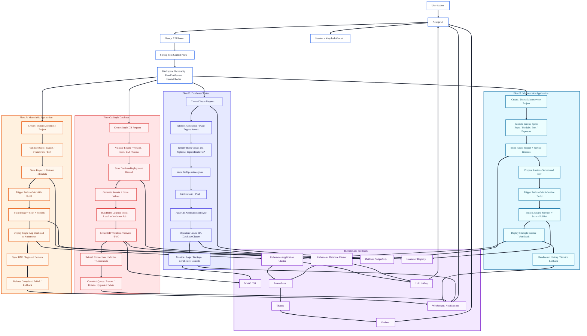

# Autonomous Infrastructure and Architecture

Project scanned from: `D:\CSTADPreUniversityTraining\ITP\a8sfinallProject`

This document describes the infrastructure and architecture of the Autonomous project. The project is a Kubernetes-based self-service platform with four major product lanes:

- Monolithic application deployment
- Microservice application deployment
- Single database deployment
- Database cluster deployment

The diagrams are written in Mermaid so they can be rendered in GitHub-style Markdown tools, Mermaid Live Editor, or converted into a visual diagram for slides.

## 1. Infrastructure Description

Autonomous is organized as a platform made of application repositories, backend control-plane services, Kubernetes infrastructure, database platform charts, GitOps delivery, observability, security scanning, and network access tooling.

The frontend layer is built mainly from `a8s-frontend`, with additional admin and documentation apps in `a8s-admin` and `a8s-documentation`. The frontend is a Next.js and React application. It exposes pages for marketing, sign-in, dashboard, project creation, deployments, database deployments, cluster deployments, logs, monitoring, image scanning, notifications, profile, settings, and GitHub application integration. It also has Next.js API routes that work as a BFF/proxy layer between browser UI code and the backend.

The authentication and access layer uses Better Auth session management in the frontend, Keycloak/OIDC support in the backend, and OAuth provider callback routes for providers such as Google and GitHub. Protected frontend routes are guarded by session checks before users reach the dashboard, project, deployment, profile, and settings areas.

The backend control plane is `a8s-backend`, a Spring Boot Java application. It owns the main platform APIs, user ownership checks, workspace lookup, entitlement checks, project state, deployment state, database state, backup policies, notification events, and integration calls. It uses Spring Security, OAuth2 resource server support, JPA, Redis, WebSocket support, the Fabric8 Kubernetes client, MinIO SDK, Keycloak admin client, Jenkins integration, SonarQube integration, and database drivers.

The platform persistence layer has a platform PostgreSQL database from `a8s-db`. That chart stores Autonomous application data such as users, workspaces, projects, deployments, releases, database deployment records, backup policies, and operational status. It uses a PostgreSQL container with Longhorn-backed persistent storage.

The runtime infrastructure is Kubernetes-first. The `a8s-infra` folder contains Kubernetes automation, ingress creation, CSI driver setup, metrics server setup, Cilium network plugin configuration, and Ansible/Kubespray-style setup tasks. The platform also contains `ingressSetting`, which documents a Traefik TCP gateway running as a host-networked DaemonSet on Kubernetes nodes.

The database platform is split into two modes. Single database deployments are handled directly by the backend using the `singledb` module and Helm execution. Database cluster deployments are handled by the `dbcluster` module through GitOps, Argo CD ApplicationSet, and the `ab-cluster/db-cluster` Helm chart.

Observability is provided through Prometheus, Grafana, Thanos, Loki, Alloy, and alert rules. The `multi-cluster-monitoring` folder documents a main monitoring cluster with Prometheus, Thanos Query, Thanos Store Gateway, Grafana, and MinIO, plus source/database clusters running Prometheus and Thanos sidecars. The `namespace-per-user-log` folder contains quota, RBAC, Loki/Alloy log streaming, and alert configuration.

Security and delivery tooling is represented by Jenkins pipelines, GitHub workflows, Trivy image scanning, DefectDojo-style shared Jenkins libraries, SonarQube integration, Harbor/container registry integration, WireGuard VPN setup, DNS/firewall guidance, and Kubernetes namespace isolation.

## 2. Main Product Lanes

### 2.1 Monolithic Application Deployment

The monolithic lane is for a project where one repository or source package becomes one deployed application. The backend module is `features/monolithic`.

Important backend pieces:

- `ProjectController` exposes `/api/v1/projects`.
- `ProjectEnvironmentController` handles project environment variables and `.env` import.
- `ProjectWebhookController` handles project webhook settings, branches, auto-deploy, and webhook rotation.
- `WebhookController` receives GitHub and GitLab webhook events.
- `MonolithProjectServiceImpl` handles deletion, cleanup, DNS cleanup, and Jenkins delete jobs.
- `ProjectReleaseService` and `ProjectReleaseRepository` track release state and rollback data.
- `ProjectVaultEnvironmentService` stores runtime environment configuration.

Monolithic deployment flow:

1. A user creates or imports a project from the frontend.
2. The frontend calls the Next.js project API route, which forwards the request to the Spring Boot backend.
3. The backend validates the user, workspace, project name, repository, branch, framework, app port, custom domain, and environment variables.
4. The backend stores project and release metadata in the platform PostgreSQL database.
5. Jenkins is triggered through `JenkinsService.triggerBuild`.
6. Jenkins builds the application, creates a container image, runs quality/security checks, and deploys the workload to Kubernetes.
7. Kubernetes runs the application as a normal app workload with Service/Ingress exposure.
8. DNS records and custom domain records are created or synchronized through the platform DNS service.
9. Release completion, failure, rollback, and delete callbacks update the backend state.
10. The frontend shows deployment status, logs, domains, releases, rollback options, and runtime state.

Monolithic lane characteristics:

- One project maps to one main runtime application.
- Release state is tracked per project.
- Rollback is managed around project releases.
- Webhooks can trigger auto-deploy from source control.
- Deletion may queue Jenkins cleanup and remove DNS/registry artifacts.

### 2.2 Microservice Application Deployment

The microservice lane is for a project composed of multiple services. Each service can have its own repository path, framework, port, image, environment variables, runtime config file, public exposure, and domain mapping. The backend module is `features/microservice`.

Important backend pieces:

- `MicroserviceProjectController` exposes `/api/v1/projects/microservices`.
- `MicroserviceDetectionService` detects candidate services from source repositories.
- `MicroserviceProjectServiceImpl` creates projects, validates service definitions, stores service metadata, and triggers Jenkins.
- `ProjectMicroserviceRepository` stores each service under the project.
- `MicroserviceRuntimeSecretService` prepares runtime secrets.
- `MicroserviceEnvironmentStorageSupport` manages service environment variables.
- `MicroserviceGitopsHistoryService` reads rollback history and current image tags.
- `MicroserviceProjectRuntimeSupport` reads live runtime pods and image state.
- `InternalMicroserviceSourceArchiveController` exposes internal source archive download for build automation.
- `InternalWorkspaceDefectDojoTokenController` exposes internal DefectDojo token support for pipeline security reporting.

Microservice deployment flow:

1. A user creates a microservice project or asks the platform to detect services from source.
2. The frontend sends service specs such as name, repository, branch, framework, module path, port, environment, runtime config, and public exposure.
3. The backend validates all services and checks workspace entitlement for microservice routing.
4. The backend stores one parent project and many `ProjectMicroservice` records.
5. Runtime secrets and environment variables are prepared for each service.
6. Jenkins is triggered through `JenkinsService.triggerMicroservicesBuild`.
7. Jenkins builds each changed service, scans images, publishes images, and updates/deploys Kubernetes manifests.
8. Kubernetes runs multiple service workloads under the same project.
9. Service domains, custom domains, public/private exposure, and route state are synchronized.
10. Runtime pods, service environment variables, service history, rollback options, and readiness are reported back to the UI.

Microservice lane characteristics:

- One project maps to many service components.
- Each service can have different repo/module/runtime configuration.
- The platform can detect services before deployment.
- Auto-deploy can be branch or release based.
- Rollback is based on image tag history across services.
- Domain updates can be GitOps-only when image rebuild is not required.

### 2.3 Single Database Deployment

The single database lane is for a user-managed database instance deployed directly by the backend. The backend module is `features/singledb`.

Important backend pieces:

- `DatabaseDeploymentController` exposes `/api/v1/database-deployments`.
- `DatabaseDeploymentServiceImpl` owns create, clone, update, delete, status, password, TLS, metrics, and console operations.
- `DatabaseDeploymentRepository` persists deployment records.
- `DatabaseChartSourceService` resolves the database Helm chart source.
- `DatabaseHelmService` runs `helm upgrade --install` directly or through an in-cluster Helm Job.
- `DatabaseDeploymentSizingService` resolves CPU, memory, and storage profiles.
- `DatabaseDeploymentVersionCatalogService` validates supported versions.
- `DatabaseDeploymentMetricsService` returns metrics.
- `DatabaseDeploymentPasswordRotationService` rotates credentials.
- `DatabaseDeploymentOperationSupportService` supports restart and operational actions.
- `DatabaseDeploymentCloneContentService` supports clone-from-backup flows.

Supported single database engines:

- PostgreSQL
- MySQL
- MongoDB
- Redis
- Cassandra
- Oracle Database
- Microsoft SQL Server

Single database deployment flow:

1. A user chooses a database engine, project name, version, size profile, storage size, TLS option, and exposure option.
2. The frontend calls `/api/v1/database-deployments`.
3. The backend validates the user, workspace namespace, quota, engine, version, password, database name, username, sizing, TLS, and network policy settings.
4. The backend creates a `DatabaseDeployment` record with status `INSTALLING`.
5. The backend prepares Kubernetes secrets, generated passwords if needed, TLS settings, NetworkPolicy, PVC sizing, and Helm values.
6. `DatabaseHelmService` runs Helm either locally or as an in-cluster Helm Job using the `alpine/helm` image.
7. Kubernetes creates the database workload, Service, Secret, PVC, and optional external proxy resources.
8. The backend refreshes connection state, service host, port, status, progress messages, and credentials metadata.
9. Users can view credentials, metrics, console namespaces, database objects, table data, and run console queries from the frontend.
10. Users can restart, rotate password, verify password, upgrade version, clone from backup, or delete the database.

Single database lane characteristics:

- Backend-driven deployment path.
- Good for one database per request.
- Uses direct Kubernetes and Helm operations.
- Can expose external access through gateway/proxy settings.
- Includes console APIs for browsing and querying the database.
- Supports Oracle and SQL Server in addition to the database cluster engines.

### 2.4 Database Cluster Deployment

The database cluster lane is for operator-backed database clusters managed with GitOps. The backend module is `features/dbcluster`.

Important backend pieces:

- `ClusterDeploymentController` exposes `/api/namespaces/{namespace}/cluster-deployments` and `/api/v1/cluster/namespaces/{namespace}/cluster-deployments`.
- `ClusterController` exposes cluster records, settings, metrics, console APIs, generated values, certificate download, backup settings, upgrade, delete, and clone-from-backup flows.
- `KubernetesController` exposes namespace pods, overview, database resources, events, services, PVCs, pod log streams, and deployment streams.
- `ClusterService` orchestrates cluster save/deploy/update/delete operations.
- `GitOpsDeploymentServiceImpl` writes values into the GitOps repo, commits, and pushes.
- `HelmValuesServiceImpl` renders per-user Helm values and optional Traefik `IngressRouteTCP`.
- `DbClusterSecretProvisioningService` prepares database secrets.
- `KubernetesCertificateService` handles certificate download.
- `KubernetesResourceQueryService` reads live cluster resources.
- `MinioBucketService` prepares object storage paths.
- `CloudflareDnsService` supports public DNS records.

Supported database cluster engines:

- PostgreSQL with CloudNativePG
- MongoDB with Percona MongoDB Operator
- MySQL with Percona XtraDB Cluster Operator
- Redis with Redis Operator
- Cassandra with K8ssandra Operator

Database cluster deployment flow:

1. A user chooses a target namespace, target Kubernetes cluster, database engine, instance count, storage size, resource profile, public hostnames, TLS, monitoring, and backup options.
2. The frontend calls the cluster deployment API.
3. The backend checks namespace ownership, entitlements, plan tier limits, and engine access.
4. The backend renders per-user Helm values with `HelmValuesServiceImpl`.
5. The backend writes the values to the GitOps repo under the configured values root, normally `db-cluster/users/<target-cluster>/<namespace>/<cluster-folder>/values.yaml`.
6. If shared gateway is enabled, the backend also renders an `ingressroute-tcp.yaml`.
7. `GitOpsDeploymentServiceImpl` runs `git add`, `git commit`, and `git push`.
8. Argo CD ApplicationSet watches the GitOps repo and detects the new or changed values path.
9. Argo CD renders the `ab-cluster/db-cluster` Helm chart and syncs it into the target namespace.
10. Kubernetes operators create the database cluster resources, services, TLS, PVCs, exporters, backup jobs, and health objects.
11. The platform reads live pods, services, PVCs, events, metrics, generated values, certificates, and deployment streams.
12. Users can update backup settings, view console data, upgrade, clone, or delete clusters.

Database cluster lane characteristics:

- GitOps-driven deployment path.
- Best for production-like clustered databases.
- Supports operator-native HA patterns.
- Uses Longhorn storage and per-engine operators.
- Integrates with Argo CD ApplicationSet.
- External access can use Traefik TCP gateway or an external TCP proxy.
- Backup settings are Spring-managed and can target MinIO/S3-compatible storage.

## 3. Architecture Flow Description

All four lanes share the same front door:

1. The user opens the Autonomous frontend.
2. Better Auth checks session state for protected pages.
3. Keycloak/OIDC and OAuth providers handle identity.
4. The frontend sends API calls through Next.js API routes.
5. The Spring Boot backend validates user, workspace, entitlement, and ownership.
6. The backend chooses the correct lane: Monolithic, Microservice, Single Database, or Database Cluster.
7. Delivery systems create or update Kubernetes resources.
8. Observability systems return logs, metrics, events, status, and notifications.

After the shared entry, the lanes split:

- Monolithic applications go through project/release metadata, Jenkins build, image publishing, Kubernetes app deployment, DNS/Ingress, release callbacks, and rollback.
- Microservice applications go through service detection or service specification, multi-service validation, Jenkins multi-service build, image publishing, Kubernetes service deployment, service-level domains, readiness, and image-tag rollback history.
- Single database deployments go through direct backend orchestration, Helm values generation, Helm execution, Kubernetes database workload creation, PVCs, credentials, TLS, metrics, console APIs, and lifecycle operations.
- Database cluster deployments go through backend values rendering, GitOps commit/push, Argo CD ApplicationSet sync, database operators, PVCs, monitoring, backups, certificates, and live resource inspection.

## 4. Infrastructure Diagram

```mermaid
%%{init: {"theme":"base","themeVariables":{"background":"#f8fafc","primaryColor":"#ffffff","primaryTextColor":"#0f172a","primaryBorderColor":"#334155","lineColor":"#111827","clusterBkg":"#eef2ff","clusterBorder":"#334155","fontFamily":"Inter, Arial, sans-serif"}}}%%
flowchart TB
    user["Users / Admins"]

    subgraph frontend["Frontend Layer"]
        web["Autonomous Web App<br/>a8s-frontend<br/>Next.js / React"]
        admin["Admin App<br/>a8s-admin"]
        docs["Documentation App<br/>a8s-documentation"]
        bff["Next.js API Routes<br/>BFF / Proxy"]
        session["Better Auth Session<br/>Protected Routes"]
    end

    subgraph identity["Access Management"]
        keycloak["Keycloak<br/>OIDC Provider"]
        oauth["OAuth Providers<br/>Google / GitHub"]
    end

    subgraph backend["Backend Control Plane"]
        api["A8S Backend<br/>Spring Boot / Java"]
        authz["Security / Ownership<br/>Workspace / Entitlements"]
        stateapi["REST + WebSocket APIs"]
        notify["Notifications<br/>Live Updates"]
    end

    subgraph monolith["Monolithic Lane"]
        mono_api["ProjectController<br/>/api/v1/projects"]
        mono_env["Project Environment<br/>Vault / Env Import"]
        mono_release["Project Releases<br/>Rollback / Delete"]
        mono_webhook["GitHub / GitLab Webhooks<br/>Auto Deploy"]
        mono_jenkins["Jenkins Monolith Build"]
        mono_runtime["Single App Workload<br/>Deployment / Service / Ingress"]
    end

    subgraph micro["Microservice Lane"]
        micro_api["MicroserviceProjectController<br/>/api/v1/projects/microservices"]
        micro_detect["Service Detection<br/>Repo / Module / Port"]
        micro_state["Project + Service Records<br/>ProjectMicroservice"]
        micro_secret["Runtime Secrets<br/>Service Env / Config Files"]
        micro_jenkins["Jenkins Multi-Service Build"]
        micro_runtime["Multiple Service Workloads<br/>Services / Routes / Pods"]
    end

    subgraph singledb["Single Database Lane"]
        single_api["DatabaseDeploymentController<br/>/api/v1/database-deployments"]
        single_state["DatabaseDeployment Record<br/>Status / Credentials / Settings"]
        single_helm["DatabaseHelmService<br/>Helm Local or Helm Job"]
        single_workload["Single DB Workload<br/>StatefulSet or Deployment"]
        single_console["DB Console APIs<br/>Test / Objects / Query"]
    end

    subgraph dbcluster["Database Cluster Lane"]
        cluster_api["ClusterDeploymentController<br/>ClusterController"]
        cluster_values["HelmValuesService<br/>Per-user values.yaml"]
        gitops_push["GitOpsDeploymentService<br/>Commit + Push"]
        argocd["Argo CD ApplicationSet"]
        operators["DB Operators<br/>CNPG / Percona / Redis / K8ssandra"]
        cluster_runtime["Database Clusters<br/>HA Pods / Services / PVCs"]
    end

    subgraph delivery["CI/CD and Repositories"]
        source_git["Source Repositories<br/>GitHub / GitLab"]
        gitops_repo["db-cluster-gitops<br/>User Values"]
        registry["Container Registry<br/>Harbor / Images"]
        sonar["SonarQube"]
        trivy["Trivy / DefectDojo"]
    end

    subgraph storage["Persistence and Object Storage"]
        platform_db["Platform PostgreSQL<br/>a8s-db"]
        pvc["Longhorn PVCs<br/>Runtime Data"]
        minio["MinIO / S3<br/>Backups / Metrics Blocks"]
    end

    subgraph kube["Kubernetes Infrastructure"]
        app_cluster["Application Cluster<br/>Frontend / Backend / Apps"]
        database_cluster["Database Cluster<br/>Managed DB Workloads"]
        ingress["HTTP Ingress<br/>Nginx / Ingress"]
        tcp_gateway["TCP Gateway<br/>Traefik / HAProxy"]
        network["Network Access<br/>Cilium / WireGuard / Firewall / DNS"]
    end

    subgraph observe["Observability"]
        prom["Prometheus"]
        thanos["Thanos<br/>Query / Sidecar / Store"]
        grafana["Grafana"]
        loki["Loki / Alloy"]
        alerts["Alerts / Quotas"]
    end

    user --> web
    user --> admin
    user --> docs
    web --> bff
    admin --> bff
    bff --> session
    session --> keycloak
    session --> oauth
    bff --> stateapi
    stateapi --> api
    api --> authz
    api --> notify
    api --> platform_db

    authz --> mono_api
    mono_api --> mono_env
    mono_api --> mono_release
    mono_api --> mono_webhook
    mono_api --> mono_jenkins
    mono_webhook --> source_git
    mono_jenkins --> sonar
    mono_jenkins --> trivy
    mono_jenkins --> registry
    registry --> mono_runtime
    mono_runtime --> app_cluster
    mono_runtime --> ingress

    authz --> micro_api
    micro_api --> micro_detect
    micro_api --> micro_state
    micro_api --> micro_secret
    micro_api --> micro_jenkins
    micro_detect --> source_git
    micro_jenkins --> sonar
    micro_jenkins --> trivy
    micro_jenkins --> registry
    registry --> micro_runtime
    micro_runtime --> app_cluster
    micro_runtime --> ingress

    authz --> single_api
    single_api --> single_state
    single_api --> single_helm
    single_helm --> single_workload
    single_workload --> database_cluster
    single_workload --> pvc
    single_workload --> tcp_gateway
    single_api --> single_console
    single_console --> single_workload

    authz --> cluster_api
    cluster_api --> cluster_values
    cluster_values --> gitops_push
    gitops_push --> gitops_repo
    gitops_repo --> argocd
    argocd --> operators
    operators --> cluster_runtime
    cluster_runtime --> database_cluster
    cluster_runtime --> pvc
    cluster_runtime --> tcp_gateway
    cluster_runtime --> minio

    app_cluster --> prom
    database_cluster --> prom
    prom --> thanos
    thanos --> grafana
    thanos --> minio
    app_cluster --> loki
    database_cluster --> loki
    prom --> alerts
    loki --> alerts
    alerts --> notify
    ingress --> network
    tcp_gateway --> network

    linkStyle default stroke:#111827,stroke-width:2.8px,color:#111827

    style frontend fill:#e8f1ff,stroke:#1d4ed8,stroke-width:2.5px,color:#0f172a
    style identity fill:#edf5ff,stroke:#2563eb,stroke-width:2.5px,color:#0f172a
    style backend fill:#ecfdf5,stroke:#15803d,stroke-width:2.5px,color:#052e16
    style monolith fill:#fff1df,stroke:#ea580c,stroke-width:2.5px,color:#7c2d12
    style micro fill:#e0f7ff,stroke:#0369a1,stroke-width:2.5px,color:#0c4a6e
    style singledb fill:#ffe4e6,stroke:#dc2626,stroke-width:2.5px,color:#7f1d1d
    style dbcluster fill:#e6e9ff,stroke:#4f46e5,stroke-width:2.5px,color:#1e1b4b
    style delivery fill:#f3e8ff,stroke:#7e22ce,stroke-width:2.5px,color:#3b0764
    style storage fill:#ffedd5,stroke:#c2410c,stroke-width:2.5px,color:#7c2d12
    style kube fill:#e0f2fe,stroke:#075985,stroke-width:2.5px,color:#082f49
    style observe fill:#f5f3ff,stroke:#6d28d9,stroke-width:2.5px,color:#3b0764

    classDef front fill:#ffffff,stroke:#2563eb,stroke-width:2px,color:#0f172a
    classDef back fill:#f0fdf4,stroke:#15803d,stroke-width:2px,color:#052e16
    classDef mono fill:#fff7ed,stroke:#ea580c,stroke-width:2px,color:#7c2d12
    classDef micro fill:#ecfeff,stroke:#0369a1,stroke-width:2px,color:#0c4a6e
    classDef single fill:#fff1f2,stroke:#dc2626,stroke-width:2px,color:#7f1d1d
    classDef cluster fill:#eef2ff,stroke:#4f46e5,stroke-width:2px,color:#1e1b4b
    classDef ops fill:#faf5ff,stroke:#7e22ce,stroke-width:2px,color:#3b0764

    class web,admin,docs,bff,session,keycloak,oauth front
    class api,authz,stateapi,notify back
    class mono_api,mono_env,mono_release,mono_webhook,mono_jenkins,mono_runtime mono
    class micro_api,micro_detect,micro_state,micro_secret,micro_jenkins,micro_runtime micro
    class single_api,single_state,single_helm,single_workload,single_console single
    class cluster_api,cluster_values,gitops_push,argocd,operators,cluster_runtime cluster
    class source_git,gitops_repo,registry,sonar,trivy,platform_db,pvc,minio,app_cluster,database_cluster,ingress,tcp_gateway,network,prom,thanos,grafana,loki,alerts ops
```

## 5. Architecture Diagram

## 6. Quick Comparison

| Lane | Main backend module | Main trigger | Delivery method | Runtime result | Best for |
| --- | --- | --- | --- | --- | --- |
| Monolithic application | `features/monolithic` | Project create/import or webhook | Jenkins build and Kubernetes deployment | One application workload | One repo, one deployable app |
| Microservice application | `features/microservice` | Service detection or service specs | Jenkins multi-service build and Kubernetes deployment | Many service workloads | Multi-service systems with separate ports/routes |
| Single database | `features/singledb` | Database deployment request | Backend-driven Helm execution | One database workload | Fast self-service database instance |
| Database cluster | `features/dbcluster` | Cluster deployment request | GitOps values, Argo CD, Helm, operators | HA/operator-backed database cluster | Production-style managed database clusters |

## 7. Folder Map

| Folder | Role in Autonomous |
| --- | --- |
| `a8s-frontend` | Main Next.js product UI and frontend API routes |
| `a8s-admin` | Admin-facing Next.js application |
| `a8s-backend` | Spring Boot control plane for projects, databases, GitOps, monitoring, auth, notifications, and integrations |
| `a8s-db` | Helm chart for platform PostgreSQL database |
| `a8s-infra` | Kubernetes and infrastructure automation |
| `ab-cluster` | Database cluster Helm charts and operator-backed database platform |
| `db-cluster-gitops` | Argo CD ApplicationSet and per-user values repository structure |
| `db-cluster` / `database-cluster` | Database cluster application/UI/supporting artifacts |
| `ingressSetting` | Traefik TCP database gateway documentation |
| `multi-cluster-monitoring` | Prometheus, Thanos, Grafana, MinIO monitoring design |
| `namespace-per-user-log` | Namespace quotas, RBAC, Loki/Alloy log streaming, and alerts |
| `thanos-client` | Thanos client/ingress/load balancer manifests |
| `trivy` | Image vulnerability scanning support |
| `Wireguard-setup` | VPN/private access documentation |
| `share-lib-defetchdojo` | Shared Jenkins library for security integration |
